# Deep-Pack in PyTorch
[](https://github.com/JeepWay/DeepPack/blob/main/LICENSE)  

This repository contains a Pytorch **unofficial** implementation of the algorithm presented in the paper [Deep-Pack: A Vision-Based 2D Online Bin Packing Algorithm with Deep Reinforcement Learning](https://ieeexplore.ieee.org/document/8956393)


## Modified CNN Architecture
Because the dimension of the proposed concatenated state (W×2H) inputted to the model doesn't satisfyied the dimension requirements of the CNN architecture mentioned in the paper, thus, this repository use the modified CNN architecture to train. 

:arrow_down: CNN architecture for 4x4 bin size
<p align="left">

</p>

:arrow_down: CNN architecture for 5x5 bin size
<p align="left">

</p>


## Dataset 
The all training and testing dataset are generated from `generate_train.py` with random seed 777 and `generate_test.py` with random seed 666.

To reduce the size of this repository, we don't upload the training and testing data except for 4x4 bin size with retangular item.

If you want to see the training and testing data, you can run `generate_train.py` and `generate_test.py` to generate it.


## Task type
* Bin size
    * 3x3
    * 4x4
    * 5x5
* Items type
    * Unit square (1x1)
    * Only square
    * Rectangular and square


## Environments
* OS: Window 10
* Visual Studio Code
* Anaconda3
* Python: 3.9.15
* PyTorch: 2.X.X+cu118


## Installation
* If you want to use your own env, then run:
    ```
    pip install -r install/requirements.txt
    ```
* If you want to create new env, then run:
    ```
    conda env create -f install/environment.yml
    ```
    or run: 
    ```
    .\install\install.bat
    ```


## Usage example
* `run.bat`
    * Execute the command in the `.bat` file, including training and testing parts.
* `python main.py --task rectangular --bin_w 4 --bin_h 4 --iterations 300000` 
    * Execute to train the doubleDQN model.
* `python test.py --task rectangular --bin_w 4 --bin_h 4 --sequence_type type1 --max_sequence 4  --iterations 5000` 
    * Execute to test the result of the trained doubleDQN model.


## Result Folder
The all training and testing result and log will be placed in `(items_name)_(bin_w)x(bin_h)_result` folder. 

To reduce the size of this repository, we don't upload the result folders.

If you want to see the traing log and testing result and dynamic demo gifs, you can run `run.bat` or other command lines, describes in `Usage example` section, then you will get the whole information.

```bash
├── (itemsName)_(binW)x(binH)_result
|   ├── img
|   |   ├── train_record.png
|   |   ├── test_record.png
|   |   ├── test_type*.gif
|   ├── test
|   |   ├── log.txt
|   |   ├── test_result.txt
|   ├── train
|   |   ├── log.txt
|   ├── hyperparameter.txt
|   ├── (itemsName)_(binW)x(binH).pt
```


## Experimental Results
### Train
We only show the result of 4x4 and 5x5 bin size, just like the original paper. If you want to see the result of 3x3 bin size, you can generate 3x3 training data and then train it with suitable hyper-parameters.

We plot the training curves with moving average (window size 50).

#### Training result of 4x4 bin size
| loss                                                                            | reward                                                                             | PE                                                                            |
| ------------------------------------------------------------------------------- | ---------------------------------------------------------------------------------- | ----------------------------------------------------------------------------- |
|  |  |  |
|            |            |            |
|  |  |  |


#### Training result of 5x5 bin size
| loss                                                                            | reward                                                                             | PE                                                                            |
| ------------------------------------------------------------------------------- | ---------------------------------------------------------------------------------- | ----------------------------------------------------------------------------- |
| 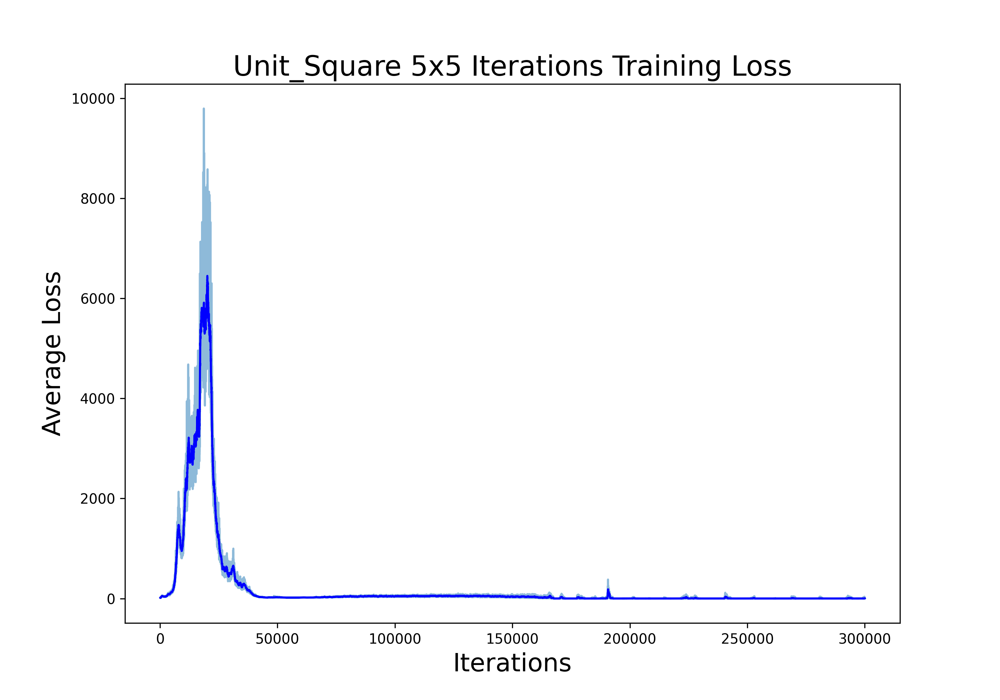 |  |  |
|            |            |            |
|  |  | 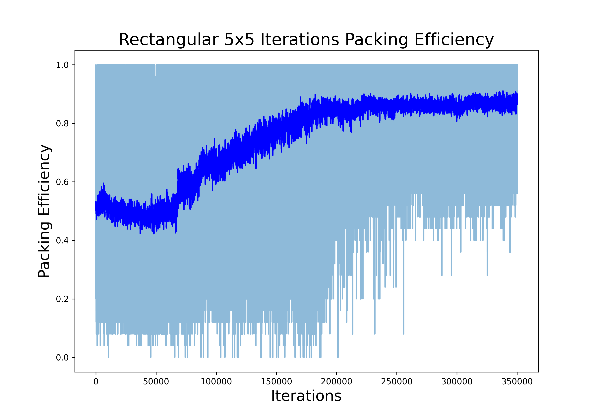 |


### Test
In test section, we only show the result of 4x4 and 5x5 bin size, just like the original paper, but we have modified some wrong sequence types of the original paper.

Because the training data which are randomly generated may not contain the specific test sequence types, leading to the model doesn't see that pattern, therefore, the result of the test may not perform as good as the training do.

We guess the the training data in the original paper contain the specific test sequence types, thus, the test result of the the original paper is awesome, not like our experiments.

<p align="center">

</p>


## Dynamic Demo Example
###  Unit square 4x4 bin with type1 sequence 
```python
'type1': [(16, (1, 1))]
```
| iter1                                                               | iter2                                                               |
| ------------------------------------------------------------------- | ------------------------------------------------------------------- |
| 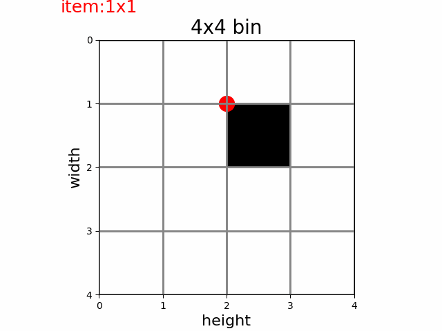 |  |


###  Square 4x4 bin with random sequence 
```python
items are all random, just like training
```
| iter1                                                               | iter2                                                               |
| ------------------------------------------------------------------- | ------------------------------------------------------------------- |
|  |  |

| iter3                                                               | iter4                                                               |
| ------------------------------------------------------------------- | ------------------------------------------------------------------- |
| 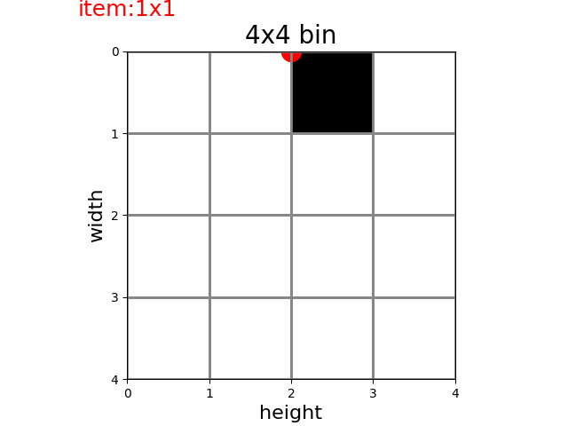 | 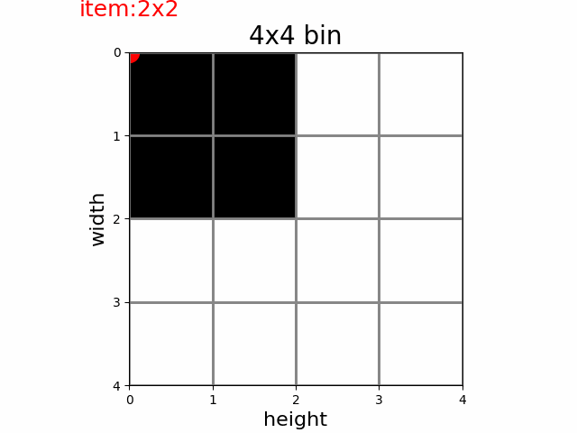 |


###  Square 4x4 bin with type1 sequence 
```python
'type1': [(1, (4, 4))]
```
| iter1                                                               | iter2                                                               |
| ------------------------------------------------------------------- | ------------------------------------------------------------------- |
|  |  |


###  Square 4x4 bin with type2 sequence 
```python
'type2': [(1, (3, 3)), (7, (1, 1))]
```
| iter1                                                               | iter2                                                               |
| ------------------------------------------------------------------- | ------------------------------------------------------------------- |
|  |  |

| iter3                                                               | iter4                                                               |
| ------------------------------------------------------------------- | ------------------------------------------------------------------- |
|  |  |


###  Square 4x4 bin with type3 sequence 
```python
'type3': [(3, (2, 2)), (4, (1, 1))]
```
| iter1                                                               | iter2                                                               |
| ------------------------------------------------------------------- | ------------------------------------------------------------------- |
|  |  |

| iter3                                                               | iter4                                                               |
| ------------------------------------------------------------------- | ------------------------------------------------------------------- |
|  |  |


###  Rectangular 4x4 bin with random sequence 
```python
items are all random, just like training
```
| iter1                                                               | iter2                                                               |
| ------------------------------------------------------------------- | ------------------------------------------------------------------- |
|  | 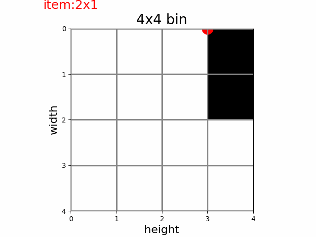 |

| iter3                                                               | iter4                                                               |
| ------------------------------------------------------------------- | ------------------------------------------------------------------- |
| 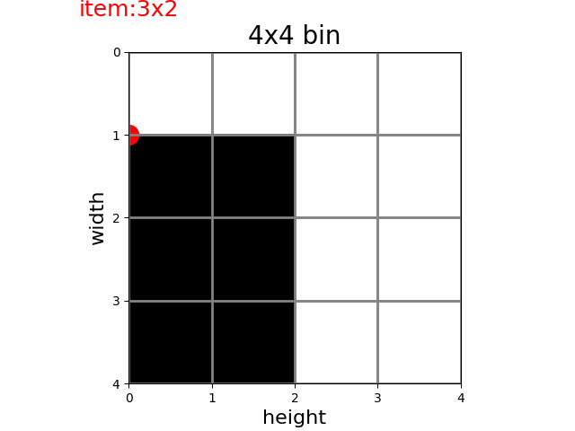 | 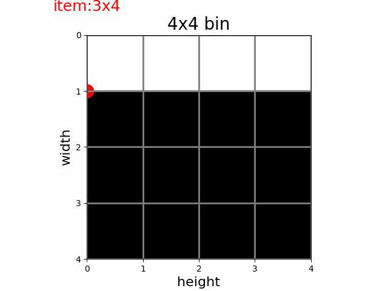 |


###  Rectangular 4x4 bin with type1 sequence 
```python
'type1': [(1, (3, 2)), (1, (1, 4)), (1, (2, 2)), (1, (1, 2))]
```
| iter1                                                               | iter2                                                               |
| ------------------------------------------------------------------- | ------------------------------------------------------------------- |
|  |  |

| iter3                                                               | iter4                                                               |
| ------------------------------------------------------------------- | ------------------------------------------------------------------- |
|  |  |


###  Rectangular 4x4 bin with type2 sequence 
```python
'type2': [(1, (1, 1)), (1, (1, 3)), (1, (3, 1)), (1, (3, 3))]
```
| iter1                                                               | iter2                                                               |
| ------------------------------------------------------------------- | ------------------------------------------------------------------- |
| 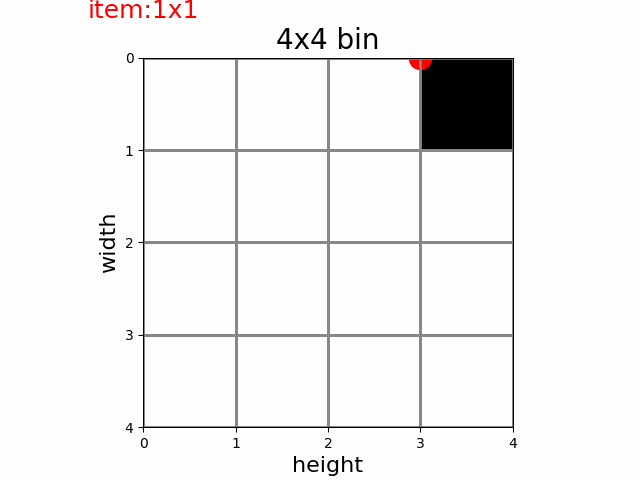 |  |

| iter3                                                               | iter4                                                               |
| ------------------------------------------------------------------- | ------------------------------------------------------------------- |
|  | 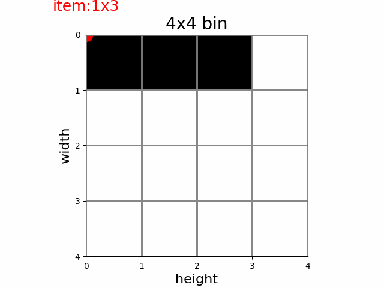 |


###  Rectangular 4x4 bin with type3 sequence 
```python
'type3': [(1, (4, 2)), (2, (2, 2))]
```
| iter1                                                               | iter2                                                               |
| ------------------------------------------------------------------- | ------------------------------------------------------------------- |
| 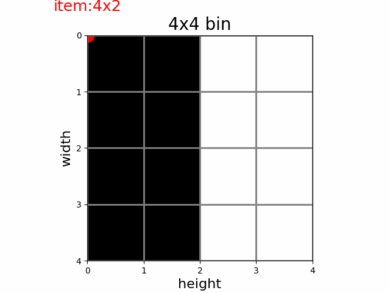 |  |

| iter3                                                               | iter4                                                               |
| ------------------------------------------------------------------- | ------------------------------------------------------------------- |
|  |  |


###  Unit square 5x5 bin with type1 sequence 
```python 
'type1': [(25, (1, 1))]
```
| iter1                                                               | iter2                                                               |
| ------------------------------------------------------------------- | ------------------------------------------------------------------- |
|  | 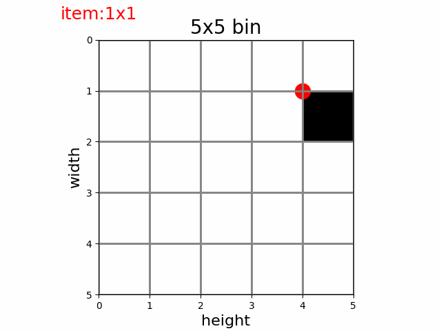 |


###  Square 5x5 bin with random sequence 
```python
items are all random, just like training
```
| iter1                                                               | iter2                                                               |
| ------------------------------------------------------------------- | ------------------------------------------------------------------- |
|  | 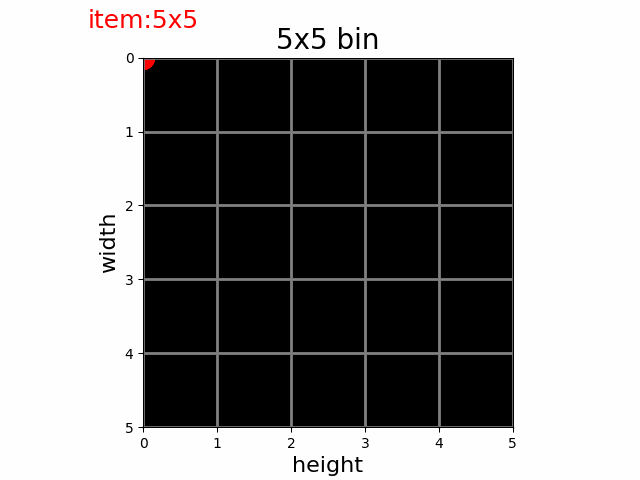 |


###  Square 5x5 bin with type1 sequence 
```python
'type1': [(1, (5, 5))]
```
| iter1                                                               | iter2                                                               |
| ------------------------------------------------------------------- | ------------------------------------------------------------------- |
|  |  |


###  Square 5x5 bin with type2 sequence 
```python
'type2': [(4, (2, 2)), (9, (1, 1))]
```
| iter1                                                               | iter2                                                               |
| ------------------------------------------------------------------- | ------------------------------------------------------------------- |
| 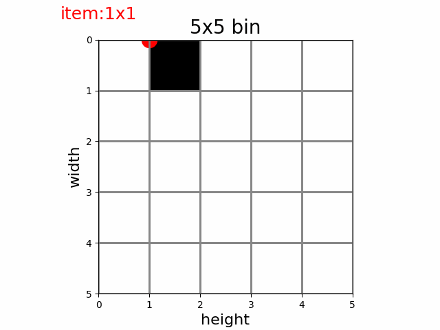 |  |

| iter3                                                               | iter4                                                               |
| ------------------------------------------------------------------- | ------------------------------------------------------------------- |
|  |  |


###  Square 5x5 bin with type3 sequence 
```python
'type3': [(1, (3, 3)), (3, (2, 2)), (4, (1, 1))]
```
| iter1                                                               | iter2                                                               |
| ------------------------------------------------------------------- | ------------------------------------------------------------------- |
|  |  |

| iter3                                                               | iter4                                                               |
| ------------------------------------------------------------------- | ------------------------------------------------------------------- |
| 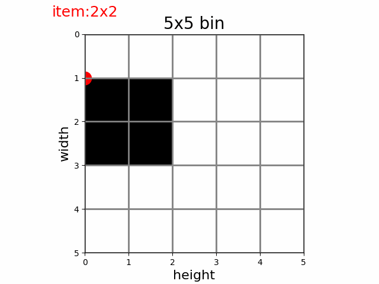 |  |


###  Rectangular 5x5 bin with random sequence 
```python
items are all random, just like training
```
| iter1                                                               | iter2                                                               |
| ------------------------------------------------------------------- | ------------------------------------------------------------------- |
|  | 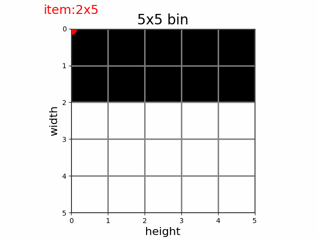 |

| iter3                                                               | iter4                                                               |
| ------------------------------------------------------------------- | ------------------------------------------------------------------- |
|  | 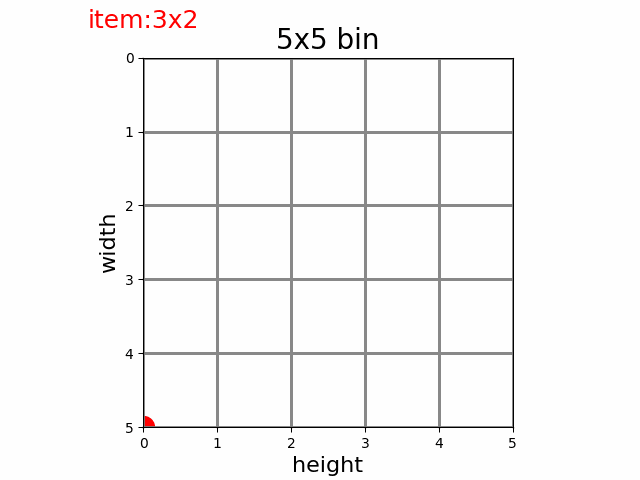 |


###  Rectangular 5x5 bin with type1 sequence
```python
'type1': [(4, (2, 2)), (1, (1, 4)), (1, (4, 1)), (1, (1, 1))]
``` 
| iter1                                                               | iter2                                                               |
| ------------------------------------------------------------------- | ------------------------------------------------------------------- |
| 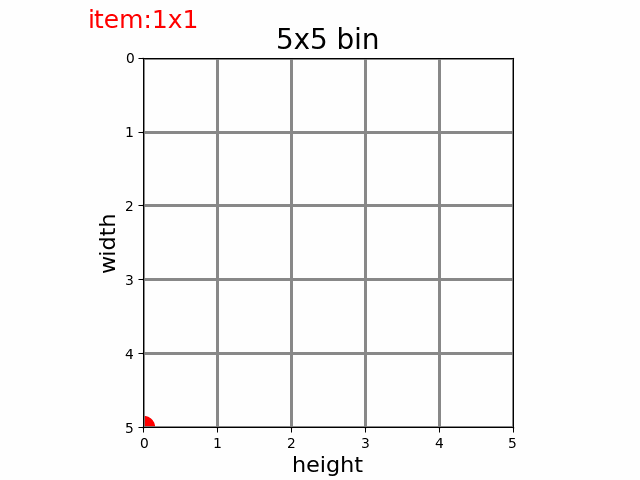 |  |

| iter3                                                               | iter4                                                               |
| ------------------------------------------------------------------- | ------------------------------------------------------------------- |
|  |  |


###  Rectangular 5x5 bin with type2 sequence 
```python
'type2': [(1, (2, 5)), (1, (3, 3)), (1, (3, 2))]
```
| iter1                                                               | iter2                                                               |
| ------------------------------------------------------------------- | ------------------------------------------------------------------- |
|  |  |

| iter3                                                               | iter4                                                               |
| ------------------------------------------------------------------- | ------------------------------------------------------------------- |
|  |  |


###  Rectangular 5x5 bin with type3 sequence 
```python
'type3': [(1, (4, 4)), (1, (1, 4)), (1, (4, 1)), (1, (1, 1))]
```
| iter1                                                               | iter2                                                               |
| ------------------------------------------------------------------- | ------------------------------------------------------------------- |
| 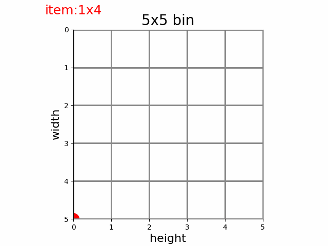 |  |

| iter3                                                               | iter4                                                               |
| ------------------------------------------------------------------- | ------------------------------------------------------------------- |
|  |  |


## References
* [Deep-Pack: A Vision-Based 2D Online Bin Packing Algorithm with Deep Reinforcement Learning](https://ieeexplore.ieee.org/document/8956393)

* [Compute cluster size and compactness]()

* [Double DQN](https://hrl.boyuai.com/chapter/2/dqn%E6%94%B9%E8%BF%9B%E7%AE%97%E6%B3%95#83-double-dqn-%E4%BB%A3%E7%A0%81%E5%AE%9E%E8%B7%B5)

* [TD3 github](https://github.com/sfujim/TD3)

* [RainbowDQN github](https://github.com/Kaixhin/Rainbow)

